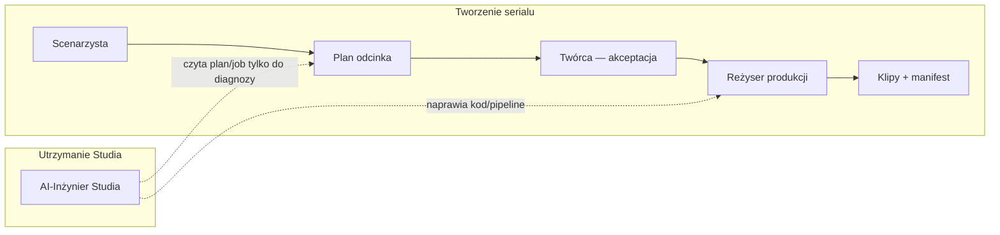

# 10. Briefing dla OPUS — wizja Kebabkiller Studio (architektura innowacji)

**Cel dokumentu:** Jednorazowy briefing dla agenta OPUS w **lokalnym Cursorze** (Plan Mode → potem implementacja po „OK” właściciela).  
**Data:** 2026-06-14  
**Autor kontekstu:** właściciel + sesje planowania (Cloud + lokalne)

---

## ZADANIE DLA OPUS (przeczytaj najpierw)

Jesteś **architektem produktu i systemu**. Twoim zadaniem jest:

1. **Przeczytać** wskazane pliki w tym repo (`kebabkiller` / Kebabkiller Studio).
2. **Zestawić** wizję docelową (poniżej + `05_EPISODE_PIPELINE.md`) z **stanem kodu** i **odrzuconymi ślepymi uliczkami**.
3. **Porównać** z równoległą wizją właściciela budowaną w **gema-0** (osobny produkt — autonomiczna fabryka oprogramowań, **niegotowy**). Nie importuj gema-0 do Studia; szukaj **wzorców** i **komplementarności**.
4. **Zaprojektować** najlepsze, innowacyjne, **perfekcyjnie działające** Kebabkiller Studio: panel, który **odzwierciedla każdy projekt/serial**, z trzema rozdzielonymi rolami AI (poniżej).
5. **Dostarczyć** plan architektury (nie kod na start) — patrz sekcja „Deliverables”.

**Tryb:** Plan Mode. Zero edycji plików dopóki właściciel nie napisze „OK, rób”.

---

## META-WIZJA (słowa właściciela — źródło prawdy intencji)

> Chcemy **najpotężniejsze, innowacyjne studio**, które będzie **odzwierciedleniem każdego projektu/serialu** — nie generyczny panel.  
> Narzędzie dla właściciela: **AI-Inżynier aplikacji Studio** — pomaga **na bieżąco udoskonalać** oprogramowanie podczas pracy w panelu (błędy systemu, kod, pipeline — **nie** pisanie odcinków).  
> **Scenarzysta** zna strukturę i możliwości silnika — tworzy scenariusze ze mną **bez odlatywania**.  
> **Reżyser produkcji** uzupełnia Scenarzystę — **idealnie pakuje** zaakceptowany plan w klipy GPU.  
> To **nie** może być „drugi Reżyser z dodatkowymi toolami”.

---

## Kolejność czytania (obowiązkowa, ~30–45 min)

| # | Plik | Po co |
|---|------|--------|
| 1 | `docs/00_START_TUTAJ.md` | Zasady repo |
| 2 | `docs/01_PROJECT_VISION.md` | Wizja produktu |
| 3 | `docs/05_EPISODE_PIPELINE.md` | **Źródło prawdy** pipeline odcinka |
| 4 | `docs/CAPABILITIES.md` | Limity silnika (Scenarzysta) |
| 5 | `docs/02_ARCHITECTURE.md` | Warstwy techniczne |
| 6 | `docs/HANDOFF_AKTUALNY.md` | Stan na dziś |
| 7 | `docs/03_AGENT_STATE_AND_TASKS.md` | Backlog, bugi |
| 8 | `docs/10_OPUS_VISION_BRIEFING.md` | Ten dokument |

### Kod — próbka (nie całe repo)

| Plik | Rola |
|------|------|
| `backend/src/ai/screenwriter.js` | Scenarzysta (CAPABILITIES w prompt) |
| `backend/src/ai/productionDirector.js` | Reżyser produkcji (mapowanie plan → GPU) |
| `backend/src/ai/directorDesk/agentServer.js` | Stół Reżyserski (wizard serial/odcinek) |
| `backend/src/ai/directorDesk/agentTools.js` | Narzędzia kreatywne |
| `frontend/src/pages/DirectorsDesk.jsx` | UI Reżyserski |
| `backend/src/video/productionQueue.js` | Kolejka produkcji |
| `docs/archive/sesja-01/05_PERELKI_Z_GEMA0.md` | Co wziąć / nie brać z gema-0 |

### Opcjonalnie (kontekst odrzuconych kierunków)

| Plik | Uwaga |
|------|--------|
| `docs/07_DEV_AGENT_PLAN.md` | Plan „Cursor Cloud w panelu” — **nie** główna wizja; przydatne tylko jako anty-wzorzec embedu |
| Branch `cursor/dev-agent-panel-9e33` (PR #9) | Groq diagnostyka — **nie** mergować jako „Programista/Cursor” |

### gema-0 (osobne repo — jeśli właściciel otworzy obok)

Przeczytaj **tylko** jeśli folder `gema-0` jest w workspace obok. Porównaj wizję „agent w rdzeniu / fabryka oprogramowań” z Kebabkiller. **Nie** proponuj merge monolitów.

---

## Trzy role AI — twardy podział (nie negocjować)



| Rola | Mandat | Widzi plany/joby? | Zapis |
|------|--------|-------------------|--------|
| **Scenarzysta** | Treść odcinka w granicach silnika | Tak — do tworzenia | Sceny, logline, deliverables |
| **Reżyser produkcji** | Paczka GPU 1:1 z planem | Tak — do renderu | Parametry techniczne (kod), nie fabuła |
| **AI-Inżynier Studia** | Błędy **oprogramowania** Studia | Tak — **tylko diagnoza** | Kod, config, recovery jobów |
| **Stół Reżyserski** (`/desk`) | Kanon **serialu**, wizard | Tak | Serial — **nie** duplikat Scenarzysty odcinka |

### Anty-wzorce (odrzucone w dyskusji)

- ❌ Cursor.com w iframe w panelu  
- ❌ Cloud Agents API jako główny tor „napraw na żywo” (nie widzi żywego SQLite/sesji)  
- ❌ gema-0 wklejone w Kebabkiller  
- ❌ Jeden chat „robi wszystko”  
- ❌ PR #9 jako drugi Reżyser / Programista Cursor  

---

## Łańcuch „idealnej sceny” (propozycja do walidacji przez OPUS)

```
StudioBrain (CAPABILITIES + katalog + wersja silnika)
    → Scenarzysta (propozycja scen)
    → PlanValidator (kod — twarde limity, anti-drift)
    → Twórca: Akceptuj plan
    → Reżyser produkcji (deterministyczny: productionDirector + kolejka)
    → Klipy
    → Scenarzysta (F3 recenzja: jedna scena do poprawy)
```

**Inżynier Studia** wchodzi, gdy validator OK + plan OK, a system i tak failed.

---

## „Studio odzwierciedla każdy serial” — kierunki do wymyślenia przez OPUS

OPUS ma zaproponować konkretną architekturę (UI + dane), np.:

- **Project DNA** — kanon, style bible, `series_memory`, generator_tags per projekt  
- **Skin / layout** — panel wizualnie i semantycznie pod serial (bez osobnego produktu na serial)  
- **StudioBrain per project** — Scenarzysta i Reżyser widzą tylko kontekst aktywnego serialu  
- **Izolacja** — dane projektu A nie „zanieczyszczają” projektu B  

Wskaż, co już jest w `projects`, `directorDesk`, `series_memory` i co brakuje.

---

## AI-Inżynier Studia — wymagania (do zaprojektowania)

- Osobny moduł, osobny chat, osobny system prompt (nie `agentServer.js`).  
- Endpoint np. `/api/system-agent/*` (nazwa do ustalenia).  
- Kontekst z UI: route, błąd API, `episode_plan_id` (do diagnozy).  
- Narzędzia: health, logi, `readFile`/`writeFile` (dev), `runTests`, read plan/job.  
- **Nie** edycja scen „bo tak ładniej” — przekierowanie na Scenarzystę.  
- Token właściciela na tunnel/LAN.

---

## Złote zasady techniczne (nie łamać)

- Nie usuwać: `director.js`, `mockEngine.js`, `runComfyEngine.js`  
- `wan_workflow_api.json` = szablon lokalny; Studio wysyła pełny `workflow_api_json`  
- Nie dotykać katalogu `gema-0` w tym repo  
- Kebabkiller Studio **niezależny** produkt obok gema-0  

---

## Deliverables od OPUS (format odpowiedzi)

Po przeczytaniu plików OPUS dostarcza **jeden dokument planu** (może być `docs/11_OPUS_ARCHITECTURE_PROPOSAL.md` po OK):

### 1. Executive summary (max 15 zdań)

### 2. Zestawienie: wizja vs kod vs odrzucone pomysły

Tabela: co jest, czego brakuje, co usunąć/scalić (np. Desk vs Scenarzysta).

### 3. Docelowa architektura AI (3 role + StudioBrain)

- Diagram komponentów (frontend, backend, agenci, walidatory)  
- Kontrakt handoff między rolami  
- Co jest automatyczne vs chat  

### 4. „Studio jako lustro serialu”

Konkretny model danych + UI (nie ogólniki).

### 5. AI-Inżynier Studia

MVP → pełna wersja; narzędzia; bezpieczeństwo.

### 6. Relacja do gema-0

Kiedy gema-0 ma sens (później jako silnik?), kiedy nie. Bez merge.

### 7. Roadmapa faz (bez szacunków czasowych)

Faza A, B, C… z kryteriami „done” i testem akceptacji.

### 8. Ryzyka i innowacje

Co jest śmiałe ale realne; co jest over-engineering.

### 9. Jedna rekomendacja

„Jeśli robimy tylko jedną rzecz w następnej sesji — to …”

---

## Prompt skrócony (wklej do OPUS w Cursor)

```text
Przeczytaj docs/10_OPUS_VISION_BRIEFING.md i wykonaj całe zadanie z sekcji „ZADANIE DLA OPUS”.
Kolejność plików: tabela w sekcji „Kolejność czytania”.
Tryb: PLAN — bez edycji kodu.
Deliverables: sekcja „Deliverables od OPUS”.
Priorytet: perfekcyjnie działające studio + idealne sceny + AI-Inżynier osobno od Scenarzysty/Reżysera.
Porównaj z wizją gema-0 jeśli mam otwarty folder obok (bez merge).
```

---

## Po planie OPUS

Właściciel czyta propozycję → wybiera wariant → **dopiero wtedy** Agent Mode na implementację wybranej fazy.

**HANDOFF** na koniec sesji: aktualizacja `HANDOFF_AKTUALNY.md` + wpis w `DZIENNIK_SESJI.md`.
