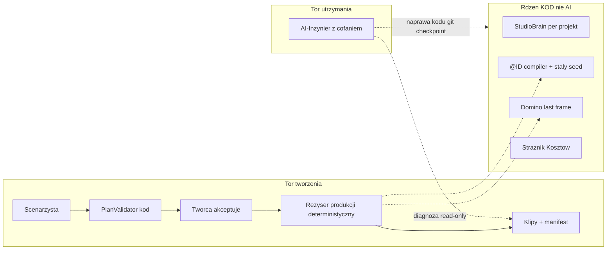

# 11. Kebabkiller Studio — ostateczna architektura (3 AI + deterministyczny rdzeń)

**Status:** zatwierdzony kierunek (sesja #17, 2026-06-14)
**Rola:** ŹRÓDŁO PRAWDY architektury. Wersja śledzona w repo (kopia planu Cursor `kebabkiller_studio_architektura_8bceddbd`).
**Implementacja:** Plan Mode → kod dopiero po „OK, rób". Robimy fazami, A jako pierwsza.

Plan oparty na audycie **kodu** (nie dokumentacji). Najpierw błędy logiczne potwierdzone w repo, potem docelowa architektura i fazy. Zasada nadrzędna: **separacja warstw twardą granicą kodu** — to lekarstwo na chaos.

## Status faz

- [x] Faza A (keystone) — jeden kanał zapisu scen + PlanValidator + frozen plan + sprzątnięcie wizarda/frontendu + legacy POST=410 + naprawa docs (sesja #18)
- [x] Faza B — deterministyczny Reżyser: `ref_id` (@ID), jeden builder, stały seed z planu, produkcja = podgląd, golden test (sesja #19)
- [ ] Faza C — Klatka Zero + rozbicie I2V_PRODUCTION + żywe tło + IP-Adapter
- [ ] Faza D — realne Domino + picker klatki + resume partial
- [ ] Faza E — AI-Inżynier MVP (pętla naprawcza z cofaniem)
- [ ] Faza F — Studio-lustro UI + sprzątanie martwego kodu

## A. Błędy logiczne znalezione w kodzie (zweryfikowane)

- **Domino jest martwe.** `continuity_mode: 'last_frame'` ustawiane w [backend/src/ai/directorDesk/workflowBuilder.js](../backend/src/ai/directorDesk/workflowBuilder.js) i kopiowane w [backend/src/video/productionQueue.js](../backend/src/video/productionQueue.js) (`enrichDirectorJson`), ale **nigdy nieczytane** — [backend/src/video/runComfyEngine.js](../backend/src/video/runComfyEngine.js) zawsze składa klatkę z assetów sceny. Brak realnej ciągłości.
- **Brak determinizmu.** Seed = `Math.floor(Math.random()*...)` w [backend/src/video/runComfyEngine.js](../backend/src/video/runComfyEngine.js) (l.184) + LLM `temperature` 0.2-0.4 w [backend/src/ai/director.js](../backend/src/ai/director.js). Ten sam plan != ten sam klip.
- **Podgląd != produkcja.** Tylko podgląd woła `buildDynamicWorkflowPayload` (wstrzykuje `style_tags` + anchor do promptu). Produkcja w [backend/src/video/productionQueue.js](../backend/src/video/productionQueue.js) używa `enrichDirectorJson`, który **nie** wstrzykuje stylu projektu do `positive_prompt`. Styl serialu nie trafia do GPU w renderze odcinka.
- **4 buildery promptu o różnej kolejności bloków:** `executeAssetBinding` ([backend/src/ai/director.js](../backend/src/ai/director.js)), `applyI2vProductionProfile` ([backend/src/ai/i2vProduction.js](../backend/src/ai/i2vProduction.js)), `compileDeterministicScenePlan` + `enrichProductionPlan` ([backend/src/ai/productionDirector.js](../backend/src/ai/productionDirector.js)).
- **Brak stabilnych ID + zła postać.** Assety to losowe `uuid` ([backend/src/db/episodeModels.js](../backend/src/db/episodeModels.js)). `executeAssetBinding` bierze `context.characters?.[0]` (pierwsza postać z bazy), a produkcja nie przekazuje `projectId`/`episodeId` -> brak kontekstu serialu i ryzyko złej postaci.
- **Desync composite.** `hasCompositeRefs` (legacy `reference_path`) w director.js vs `hasComposite` (episode refs) w productionDirector.js; `stripRedundantTextBlocks` wymaga obu assetów i dokładnego dopasowania stringa (parafraza LLM ucieka).
- **Tło zamrożone.** `I2V_PRODUCTION` ([backend/src/video/wanConfig.js](../backend/src/video/wanConfig.js)) mrozi kadr przez denoise 0.85 + static + anchor; brak osobnego wektora animacji tła; override sceny nie cofa już wbitego `camera_motion`/anchor w prompcie.
- **Brak IP-Adapter** w `wan_workflow_api.json` mimo deklaracji w system prompcie (tylko CLIPVision) — tożsamość słabo zablokowana.
- **Trzy kanały zapisu scen / dwóch planistów:** Scenarzysta ([backend/src/ai/screenwriter.js](../backend/src/ai/screenwriter.js), bez UI), narzędzia Desk ([backend/src/ai/directorDesk/agentTools.js](../backend/src/ai/directorDesk/agentTools.js)), REST w [backend/src/api/routes.js](../backend/src/api/routes.js).
- **Dwa systemy "odcinków":** `GET /projects/:id/episodes` -> `episode_plans`, `POST` ten sam path -> tabela `episodes` ([backend/src/api/routes.js](../backend/src/api/routes.js)).
- **Martwe stany wizarda:** `setSceneAnchors`/`reorderScenes` dozwolone, ale bez implementacji; `canAdvance` dla ASSETS nie sprawdza przypisania assetu, choć `validateEpisodePlan` wymaga ([backend/src/ai/directorDesk/wizardStateMachine.js](../backend/src/ai/directorDesk/wizardStateMachine.js)).
- **Brak resume produkcji:** partial failure re-renderuje wszystkie sceny od zera ([backend/src/video/productionQueue.js](../backend/src/video/productionQueue.js)).
- **Duży martwy frontend:** brak `EpisodePlan.jsx`, osierocone `JobStatus.jsx`, `MobileSceneEditor.jsx`, cały `api.episodePlans` (poza raw `produce`).
- **AI-Inżynier nie istnieje** w kodzie.

## B. Docelowa architektura

- **Scenarzysta** — fabula w granicach [docs/CAPABILITIES.md](CAPABILITIES.md); jedna implementacja, wolana z Director's Desk. Wynik: sceny/logline/braki. Nie dotyka GPU.
- **Reżyser produkcji** — deterministyczny: jeden builder promptu z `@ID`, staly seed, ta sama logika w podglądzie i produkcji. Zero LLM w torze renderu.
- **AI-Inżynier Studia** — osobny modul `/api/system-agent/*`, osobny prompt. Petla: zglaszasz problem -> diagnoza read-only -> propozycja diff -> wspolna zgoda -> checkpoint git -> apply + testy (auto-rollback gdy czerwone) -> reczne [Cofnij] + Dziennik Napraw. Poreze bezpieczenstwa: to **NIE drugi Rezyser** — edycje fabuly/scen odsyla do Scenarzysty; dostep tylko za **tokenem wlasciciela** (LAN/tunnel); zapis tylko do whitelisty plikow (**nigdy** `.env`, sekrety ani zlote pliki: `director.js`, `mockEngine.js`, `runComfyEngine.js`).
  - **Uwaga (anti-konflikt):** ten zakaz dotyczy **wylacznie autonomicznego AI-Inzyniera** (Faza E). Praca fazowa pod kontrola wlasciciela (Fazy B/C/D) **moze** edytowac `runComfyEngine.js` (seed, node IP-Adapter, last-frame) — pod review + zielonymi testami. „Zlote pliki" = nie kasowac / nie przepisywac hurtem, a nie „zamrozone na zawsze".
- **Rdzeń (kod, nie AI):** `PlanValidator`, `@ID` compiler, Strażnik Kosztów, staly seed, Domino, `buildProjectBrain` (istnieje), transakcyjny czat z undo (istnieje: `is_committed`/`undo_of_id`).

## C. Decyzje zamkniete

- Jedyny kokpit: Director's Desk. Stary flow EpisodePlan + osierocone komponenty do usuniecia.
- Postac = wycinek PNG z alfa (`@char`); podwojny zamek: composite + IP-Adapter. Tlo = `@loc`, geometria trzymana struktura (depth), tlo zyje promptem animacji.
- **Green-screen na martwej plycie odrzucony** — stabilnosc osiagamy struktura (depth) + IP-Adapter, nie zamrazaniem tla.
- Klatka Zero (scena 1) = osobny tani etap. **Pierwsza klatka to problem OBRAZU, nie wideo** — iterujesz tanio na statycznym obrazie, zanim ruszy drogie GPU. Cztery zrodla: (1) skladanie `@char + @loc` (domyslne, 0 zl), (2) upload gotowej klatki, (3) generowanie 1 obrazu AI, (4) klatka z biblioteki / poprzedniego odcinka. Domino z pickerem dla scen 2+.
- Koszty ku zeru: mock/obraz najpierw, GPU po akceptacji. **LLM local-first** — router intencji i rozmowa na lokalnym modelu (Ollama/llama.cpp), chmura tylko jako fallback / heavy "rozpisz pomysl".
- gema-0: poza architektura (zero zaleznosci).
- **Czysta karta — brak migracji danych historycznych.** Stare projekty nie sa potrzebne. Baza SQLite (`backend/data/studio.db`) moze byc w kazdej chwili skasowana i odtworzona przez seed (`init.js`). Migracje schematu (np. kolumna `ref_id` w Fazie B) **nie musza robic backfillu** — zakladaja czysty stan.
- **ZASADA NADRZEDNA: „Zastepuj, nie sklejaj".** Stary kod byl pokrecony i niespojny. Gdy legacy jest niespojny — buduj JEDNA czysta implementacje i **usun stara**; **nie** zostawiaj zlych rozwiazan jako fallback, nie godz kilku zlych pomyslow w hybryde („potwora"). Granica: trzymaj sie zakresu biezacej fazy (nie rozlewaj sie na kolejne).
- **Kontrakt @ID (zamkniety):** w `assets` dodajemy **tylko** kolumne `ref_id` (stabilny, **niemutowalny** slug, np. `char_kebabkiller`, bez `@`). Namespace (`char/loc/prop/detail`) **wyprowadzamy z istniejacego `type`** — NIE dodajemy redundantnej kolumny `kind`. `@` dokleja kompilator promptu przy budowie. Zmiana nazwy wyswietlanej NIE zmienia `ref_id`.

## D. Fazy (z kryterium "done")

- **Faza A (keystone, pierwsza):** jeden planista + twardy `PlanValidator` (kod) jako granica Scenarzysta->Reżyser + frozen plan; usuniecie duplikacji i martwego frontendu; **naprawa mylacych docs** (`HANDOFF_AKTUALNY.md`, `03_AGENT_STATE_AND_TASKS.md`) tak, by kazda nowa sesja startowala z prawdy (UI = Director's Desk; EpisodePlan = legacy; zrodlo prawdy = ten dokument). Done: plan poza limitami odrzucony przez kod; jeden kanal zapisu scen; docs startowe zgodne z kodem.
- **Faza B (ZREALIZOWANA, sesja #19):** deterministyczny Reżyser — `@ID` compiler (kolumna `ref_id` w assetach, namespace z `type`, BEZ `kind`), jeden builder, staly seed, produkcja uzywa tej samej logiki co podglad (koniec preview != prod), wstrzykniecie `style_tags`/anchor. Done: 2x ten sam plan = ten sam payload.
  - **Realne zmiany:** (1) `assets.ref_id` — stabilny, niemutowalny slug `type+name` (np. `char_kebabkiller`, bez `@`); migracja BEZ backfillu (`init.js`+`schema.sql`); namespace wyprowadzany z `type`. (2) JEDEN deterministyczny builder `compileScenePlan`/`buildSceneDirectorPlan` (`productionDirector.js`) — `expandScenePrompt` (LLM) **usuniety** z toru renderu; stara `compileDeterministicScenePlan`/`enrichProductionPlan`/`stripRedundantTextBlocks` zastapione; legacy `director.js`/`i2vProduction.js` (poza torem renderu) nietkniete. (3) `deterministicSeed(planId:sceneId)` (`wanConfig.js`) — `Math.random()` usuniety z `runComfyEngine.js`. (4) wspolny `enrichDirectorForRender` (`workflowBuilder.js`) wolany przez podglad i produkcje; rozjechany `enrichDirectorJson` (`productionQueue.js`) zastapiony. (5) **Strażnik:** `productionPayloadGolden.test.js`. Testy: 92 → 110 pass.
- **Faza C:** Klatka Zero (compose cutout+tlo, pozycja z panelu) + rozbicie `I2V_PRODUCTION` (kamera / animacja tla / beats) + zywe tlo + node IP-Adapter. Done: podglad kolazu 0 zl; 1 klip z zywym tlem i stala geometria.
- **Faza D:** realne Domino (ekstrakcja ostatniej klatki -> start nastepnej) + picker klatki + resume partial. Done: odcinek 3 scen = 3 spojne klipy + manifest, retry tylko brakujacej sceny.
- **Faza E:** AI-Inżynier MVP — `/api/system-agent`, petla naprawcza z checkpointami git + bramka testow + Dziennik Napraw + [Cofnij]. Done: sztuczny blad -> trafna diagnoza + diff + zastosowanie z mozliwoscia cofniecia.
- **Faza F:** Studio-lustro UI — `engine_profile` w panelu (kaskada Studio/Serial/Odcinek/Scena z rodowodem wartosci), skorka per serial; sprzatniecie osieroconego kodu.

## E. Rekomendacja "co robimy jako pierwsze"

**Faza A.** Pure-code, zero LLM, zero GPU, w pelni odwracalne; usuwa zywe zrodlo chaosu (dwoch planistow + trzy kanaly zapisu) i stawia zwornik (`PlanValidator`), bez ktorego deterministyczny Reżyser nie ma czystego wejscia. Najtanszy ruch o najwiekszej dzwigni.

## F. Ryzyka

- Jeden przebieg I2V (Faza C) wymaga wezlow ControlNet/depth + IP-Adapter na GPU; obecny deployment RunComfy jest za ciezki (bloker) — dobor lekkiego deploymentu to warunek Fazy C.
- AI-Inżynier z prawem zapisu (Faza E) — bramka testow + checkpoint git obowiazkowe; zapis tylko do whitelisty (nigdy `.env` ani zlote pliki).

## G. Uwaga dla nowej sesji (anti-pokrecenie)

Dokumentacja w `docs/` ma **wiele sprzecznych wersji** — NIE traktuj calego `docs/` jako zrodla prawdy. Zrodlo prawdy = **TEN dokument + realny kod**. Odrzucone kierunki: Programista/`07_DEV_AGENT_PLAN.md`, Cursor Cloud Agents API jako tor naprawy, PR #9 (Groq /dev) jako drugi Rezyser, Cursor w iframe, gema-0 merge.

## H. Protokół kontynuacji (anti-konflikt)

Fazy B→C→D dzielą te same pliki na torze renderu, więc nie są niezależne. Żeby nie powstały rozbieżności:

**Mapa nakładania plików (strefy zapalne):**

| Plik | B | C | D | F |
|---|---|---|---|---|
| `backend/src/video/runComfyEngine.js` | seed | node IP-Adapter | last-frame | — |
| `backend/src/video/productionQueue.js` | styl, preview=prod | — | resume + Domino | — |
| `backend/src/ai/directorDesk/workflowBuilder.js` | @ID compiler | osie I2V | — | — |
| `backend/src/video/wanConfig.js` / `i2vProduction.js` | — | rozbicie profilu | — | engine_profile |
| `backend/src/db/episodeModels.js` | kolumna `ref_id` (bez `kind`) | — | — | — |

`runComfyEngine.js` to główny punkt zapalny B/C/D.

**Zasady (obowiązkowe):**

1. **Ściśle sekwencyjnie B → C → D.** Nigdy dwie z tych faz równolegle (wspólny `runComfyEngine.js` / `productionQueue.js`). E = osobny moduł, można niezależnie. F na końcu.
2. **Jedno okno / jedna gałąź na fazę.** Start fazy = `git pull`; koniec = merge do `main` **przed** następną fazą. Zero dwóch agentów równolegle na render-path.
3. **Kontrakty zamrożone:** schemat `PlanValidator` (A) i schemat `@ID` (B) to umowy. Zmiana kontraktu = kontrakt **+ wszyscy konsumenci w jednym commicie**, nigdy po cichu.
4. **`docs/11` to umowa, nie notatnik:** każda faza w **tym samym commicie** odhacza status i dopisuje realne zmiany projektowe. Kod rozjechany z `docs/11` → najpierw poprawiamy `docs/11`.
5. **Test determinizmu z B = strażnik B/C/D:** „2× ten sam plan = ten sam payload" musi zostać zielony po C i D.
6. **Commit per krok** — drobne, odwracalne.
